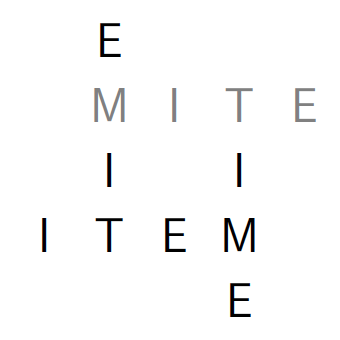

# MITE




MITE stands for

```
Mite
Item
Time
Emit
```

each of which in turn stand for:
```
Item
Time
Emit
Mite
```

```
Time
Item
Mite
Emit
```

```
Emit
Mite
Item
Time
```

... and so on.

MITE is a recursive acronym generator.

# Usage
```bash
> python MITE.py 5

ORGAN
ANGOR
GRANO
GORAN
ORANG
ROGAN
NAGOR
GROAN
ARGON

LAGER
ARGEL
GLARE
GARLE
ERGAL
LARGE
REGAL
```
(Some assembly required)

